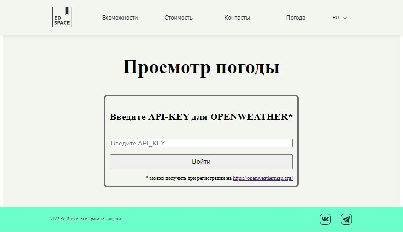
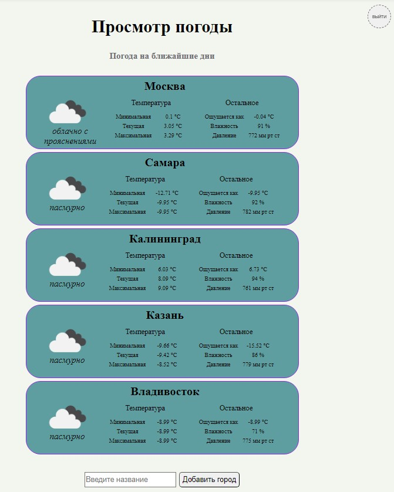
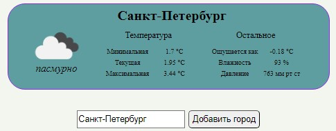

# Финальный проект Maxima School

1. ### Главная страница сайта

- Header и начальный раздел

- Раздел "Точно подойдёт для"

- Раздел "Возможности Ed Space"

- Раздел "Выбирайте Ed Space"

- Раздел "Контакты" и Footer сайта

2. ### Возможности главной страницы

   1. При нажатии на кнопку "Попробовать бесплатно" в любом из разделов - появляется модальное окно

      

   2. После установки флажка "Я согласен на обработку моих персональных данных" появляется возможность нажать на кнопку "Отправить". Объект с полученными данными выводится в консоль разработчика

      

   3. После нажатия кнопки "Отправить" в модальном окне - все кнопки "Попробовать бесплатно" на главной странице становятся неактивными. Для восстановления возможности открывать модальное окно необходимо перезагрузить страницу.

   4. При наведении на один из блоков в разделе "Возможности EdSpace" - блок подсвечивается

      

   5. При нажатии на данный блок производится переход на страницу блока, содержащую заголовок, описание и иконку данного блока в формате начального раздела, а также - один из трёх блоков раздела "Выбирайте EdSpace" (выбирается рандомно, хранится в sessionStorage)

      

   6. При нажатии на ссылки в Header / разделе "Контакты" - осуществляется переход к соответствующему разделу

   

   

2. ### Страница погоды

- При переходе на страницу погоды предлагается ввести API_KEY, доступный после регистрации на [openweathermap](https://openweathermap.org/)

- После ввода ключа осуществляется переход на страницу с информацией о погоде по пяти городам России

  

- Можно ввести название города и нажать кнопку "Добавить город" / нажать кнопку Enter - при корректно введённом названии города добавится карточка с информацией о текущей погоде в этом городе

  

- При попытке повторного добавления уже существующего города - ничего не будет происходить

- При попытке указать несуществующее название города - будет выводиться ошибка 

  

- При нажатии на карточку города - открывается страница с информацией о погоде на 5 дней с интервалами 3 часа

  

- При вводе некорректного API_KEY - будет выводиться ошибка на странице текущей погоды

  

- Для смены API_KEY необходимо нажать кнопку "Выйти", доступную на странице погоды

  